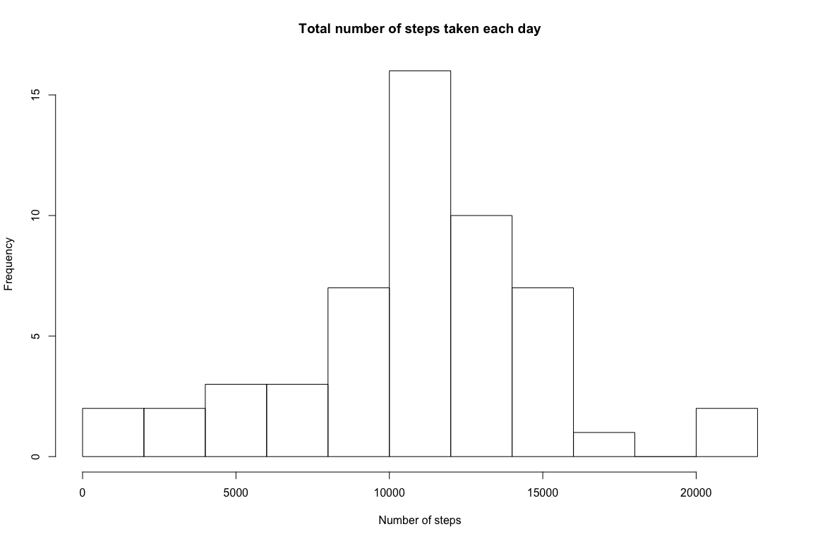
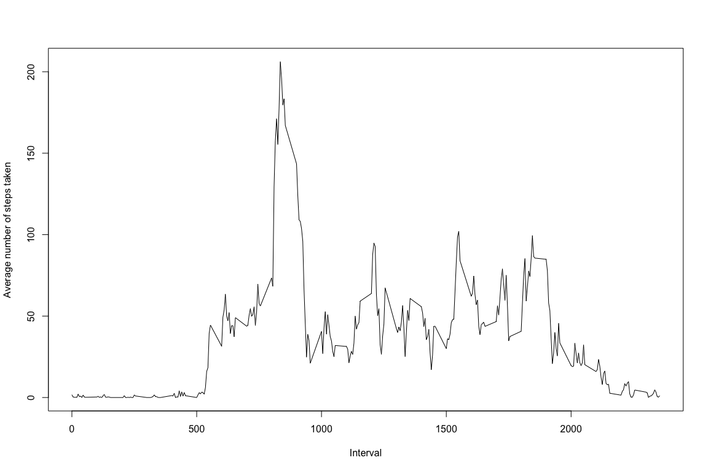
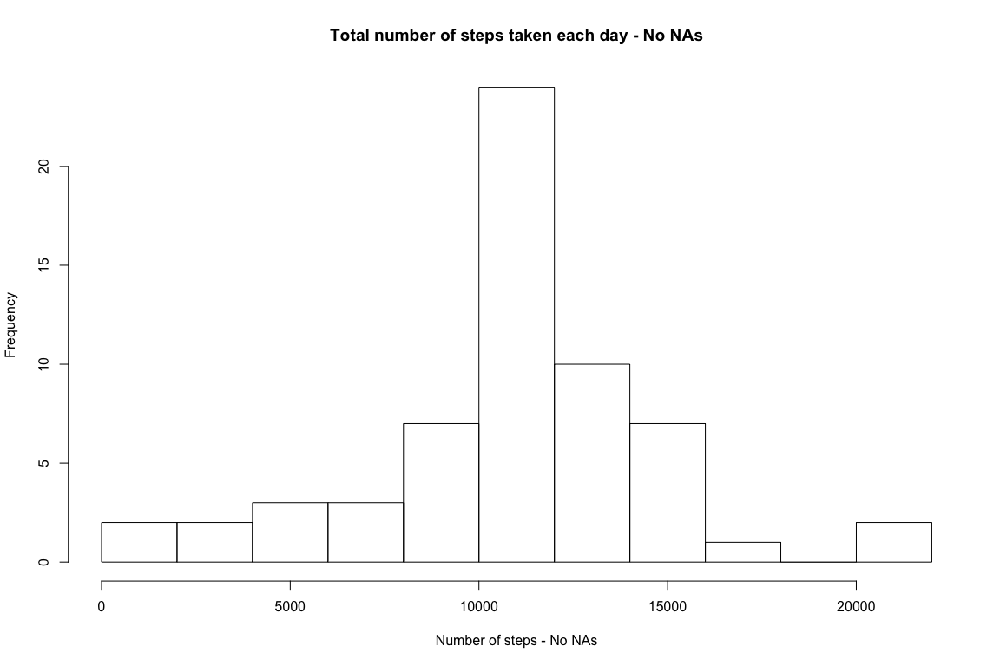
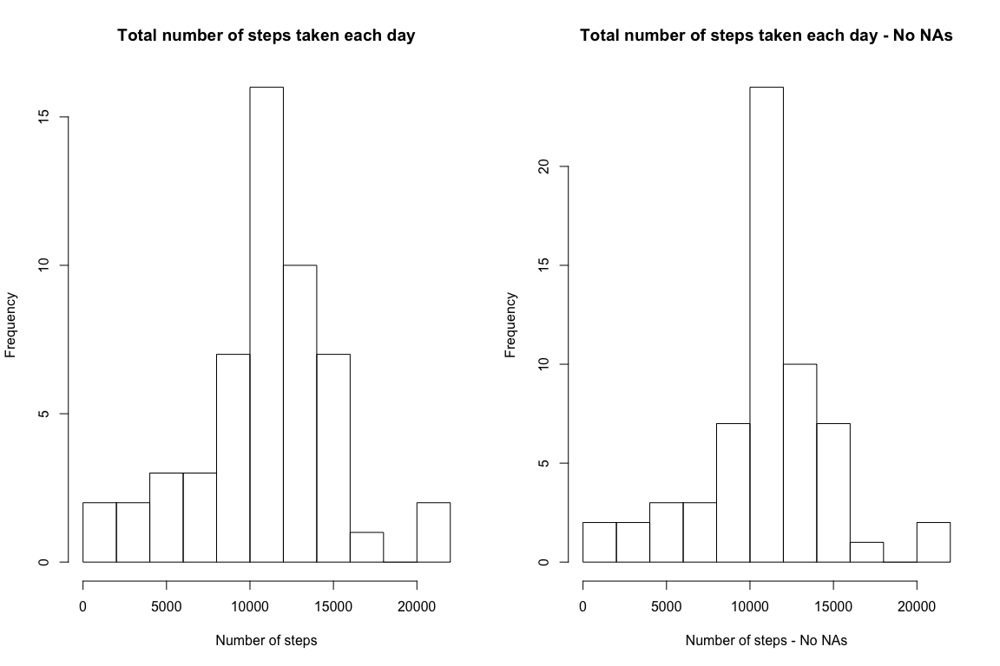
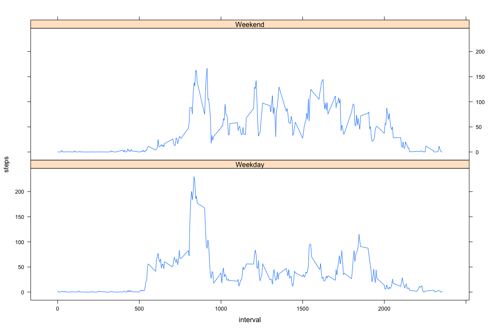

# Reproducible Research: Peer Assessment 1


## Loading and preprocessing the data

1. Load the data


```r
activityDS <- read.csv("./activity.csv", header = TRUE, stringsAsFactors = FALSE, na.strings = "NA")
```

2. Process/transform the data (if necessary) into a format suitable for your analysis


```r
activityDS$date <- as.Date(activityDS$date, format="%Y-%m-%d")
```

## What is mean total number of steps taken per day?

1. Calculate the total number of steps taken per day


```r
stepsPerDay <- tapply(activityDS$steps, activityDS$date, FUN=sum)
```

2. Make a histogram of the total number of steps taken each day


```r
hist(stepsPerDay, breaks = 10, main = 'Total number of steps taken each day', xlab='Number of steps')
```

 

3. Calculate and report the mean and median of the total number of steps taken per day


```r
meanSteps <- mean(stepsPerDay, na.rm=TRUE)
medianSteps <- median(stepsPerDay, na.rm=TRUE)
```

The mean of the total number of steps taken per day is 10766.19 and the median is 10765.

## What is the average daily activity pattern?

1. Time series plot (i.e. type = "l") of the 5-minute interval (x-axis) and the average number of steps taken, averaged across all days (y-axis)


```r
avgStepsPerInterval <- aggregate(steps ~ interval, activityDS, mean)
plot(avgStepsPerInterval$interval, avgStepsPerInterval$steps, ylab = "Average number of steps taken", xlab = "Interval", type = "l")
```

 

2. Which 5-minute interval, on average across all the days in the dataset, contains the maximum number of steps?


```r
maxInterval <- avgStepsPerInterval[avgStepsPerInterval$steps == max(avgStepsPerInterval$steps),c("interval")]
```

The 5-minute interval, on average across all the days in the dataset, which contains the maximum number of steps is interval 835.

## Imputing missing values

1. Total number of missing values in the dataset (i.e. the total number of rows with NAs)


```r
naCount <- sum(is.na(activityDS$steps))
```

The total number of missing values in the dataset 2304.

2. Devise a strategy for filling in all of the missing values in the dataset. The strategy does not need to be sophisticated. For example, you could use the mean/median for that day, or the mean for that 5-minute interval, etc.

As strategy for filling missing values we're going to use the mean number of steps for that 5-minute interval across dates.

3. Create a new dataset that is equal to the original dataset but with the missing data filled in.


```r
library(dplyr)
activityDSNoNAs <- activityDS
activityDSNoNAs <- activityDSNoNAs %>%
    group_by(interval) %>% 
        mutate(steps = ifelse(is.na(steps), as.integer(round(mean(steps, na.rm=TRUE))), steps))
```

4. Make a histogram of the total number of steps taken each day and Calculate and report the mean and median total number of steps taken per day. Do these values differ from the estimates from the first part of the assignment? What is the impact of imputing missing data on the estimates of the total daily number of steps?


```r
stepsPerDayNoNAs <- tapply(activityDSNoNAs$steps, activityDS$date, FUN=sum)
hist(stepsPerDayNoNAs, breaks = 10, main = 'Total number of steps taken each day - No NAs', xlab='Number of steps - No NAs')
```

 

Calculating the new mean and median:


```r
meanStepsNoNAs <- mean(stepsPerDayNoNAs, na.rm=TRUE)
medianStepsNoNAs <- median(stepsPerDayNoNAs, na.rm=TRUE)
```

Now, with the missing values replaced with the means, the mean of the total number of steps taken per day is 10765.64 and the median is 10762.

The mean is almost equal to the estimates from the first part of the assignment, but a bit lower.

The median is also lower when compared to the first part of the assignment, but with a more noticeable difference (when compared to the mean).

In this study the overvall 'shape' of the plots remain similar with and without the NAs, but it does show results will be different when NAs are present.

Below the side by side plot can be seen:


```r
par(mfrow=c(1,2))
hist(stepsPerDay, breaks = 10, main = 'Total number of steps taken each day', xlab='Number of steps')
hist(stepsPerDayNoNAs, breaks = 10, main = 'Total number of steps taken each day - No NAs', xlab='Number of steps - No NAs')
```

 

## Are there differences in activity patterns between weekdays and weekends?

1. Create a new factor variable in the dataset with two levels – “weekday” and “weekend” indicating whether a given date is a weekday or weekend day.


```r
activityDSNoNAs$weekday <- as.factor(ifelse(weekdays(activityDSNoNAs$date) %in% c("Saturday","Sunday"), "Weekend", "Weekday")) 
```

2. Make a panel plot containing a time series plot (i.e. type = "l") of the 5-minute interval (x-axis) and the average number of steps taken, averaged across all weekday days or weekend days (y-axis). See the README file in the GitHub repository to see an example of what this plot should look like using simulated data.


```r
avgStepsPerIntervalWeekdays <- aggregate(steps ~ weekday + interval, activityDSNoNAs, mean)

library(lattice)
xyplot(steps ~ interval | weekday, type = "l", data = avgStepsPerIntervalWeekdays,layout=c(1,2))
```

 

With the comparison panel we can see the weekends and weekdays follow different patterns, while during weekdays we see a spike of more steps at a given interval and lower activity for the rest of the periods during the weekends we see a higher average of activity spread throughout.
